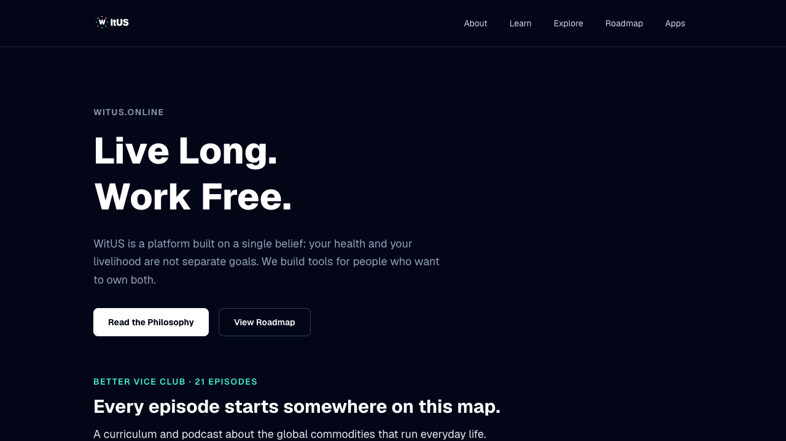
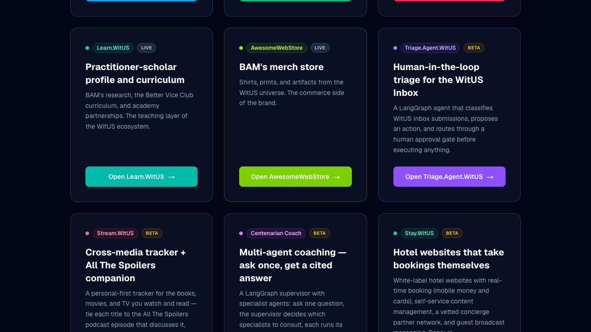
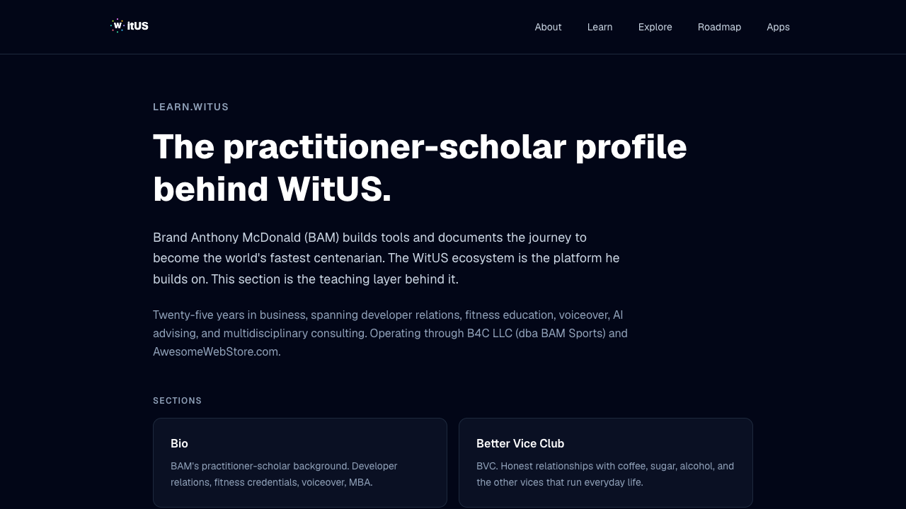

# Meet the WitUS ecosystem

> Auto-generated from `e2e/tutorials/witus-tour.tutorial.ts` — do not edit by hand.
> Regenerate: `npx playwright test --config playwright.tutorial.config.ts` then `node scripts/tutorial-video/gen-docs.mjs witus-tour`.

## 1. The front door

This is witus dot online — the front door of the WitUS ecosystem. One philosophy, live long and work free, and every tool we build hangs off it.

## 2. The product directory

Scroll down and you'll find the product directory — every WitUS app in one place, each with its own color and its own job. One account signs you into all of them.

## 3. The learn section

And behind the products there's a practitioner — the learn section carries the curriculum, the research, and the partnerships the whole ecosystem is built on.

